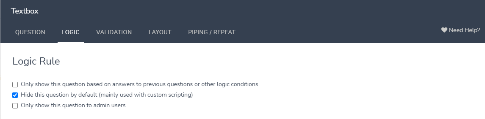

# Performance Management and Surveys

## Surveys

## Set Up

1. Create a new survey on [Alchemer (formerly SurveyGizmo)](https://www.alchemer.com).

2. Create Name question for the survey taker
    * Under Logic, alias it as “respondant_df_employee_number”
    
    * If piping from Survey HQ, create a default answer with a URL parameter (best practice is to match the Alias and the parameter)

3. Create any additional piping/logic questions (see examples below). Be sure to add aliases and default answers. You can hide questions as needed under Logic -> Hide Question By Default
    
    

4. Continue creating questions and setting up the survey. Be sure to alias each question.

5. When done, go to Style -> Themes -> Your Theme Library and apply the KTAF survey theme
    

6. Under Share, create a new campaign (outlined below).

7. The survey will now be ready to flow into [gabby](content/databases/gabby.md). You’ll need to adjust views and create an output view. Additionally, if you want to create question options (eg: Plug in a list of all active staff members), you’ll need to adjust the questions_options tool. For questions where you’re updating question options, be sure to set the options to alphabetical under Layout.
    
