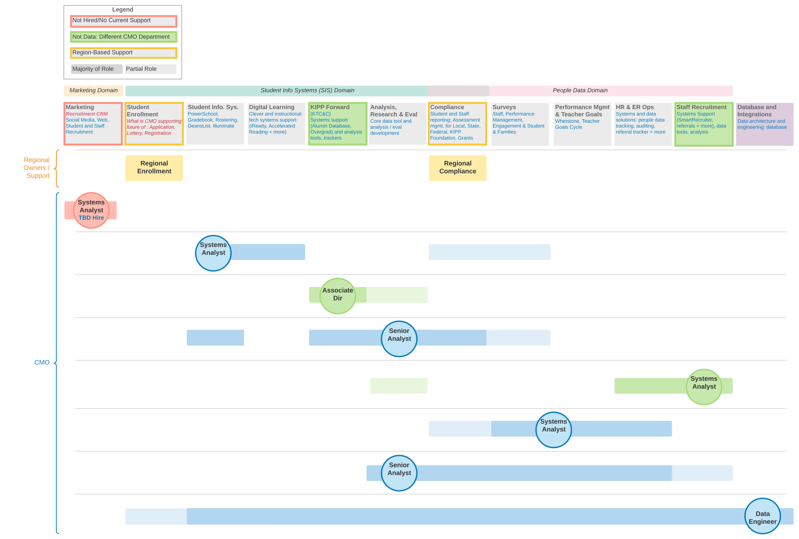

# KIPP TEAM & Family Data 

The KTAF Data Team supports tools and processes including PowerSchool, Instructional Tech, Illuminate, Assessments, Surveys, Performance Management, and more.

If you are looking for support for a question, check out these resources to help you get back on track.

Looking for Data Tools?  Go to [www.kippnj.org/data].

Learn the best way to get support and avoid frequently asked questions with Data support : [Frequently Asked Questions](https://teamschools.zendesk.com/hc/en-us/articles/115003208767-How-do-I-get-support-for-Data-Questions-Frequently-Asked-Questions-Who-does-what-for-PowerSchool-Instructional-Tech-Illuminate-Assessments-Surveys-more#h_349d4388-b0a5-480b-adaa-081901d1010b) |   [Support Updates](https://docs.google.com/presentation/d/1Nvn4DTywF46NlmqwmUyfzq4QkZrLFnZTA5AFdAZ8np4/edit?usp=sharing)

Help Guides: search for guides across support teams [Help Center](https://teamschools.zendesk.com/hc/en-us/categories/204269047-Data)

If you can't find what you are looking for: [Submit a ticket](https://teamschools.zendesk.com/hc/en-us/requests/new)

Reach out to your school point person: School Ops teams manage student schedules, purchasing and a lot of other awesome stuff to make your school run

Reach out to Teaching and Learning: your subject or assessment point people have the expertise around all things assessments, Illuminate, academic policies, F&P and more : [T&L Wiki](https://sites.google.com/apps.teamschools.org/teachingandlearning/home)

